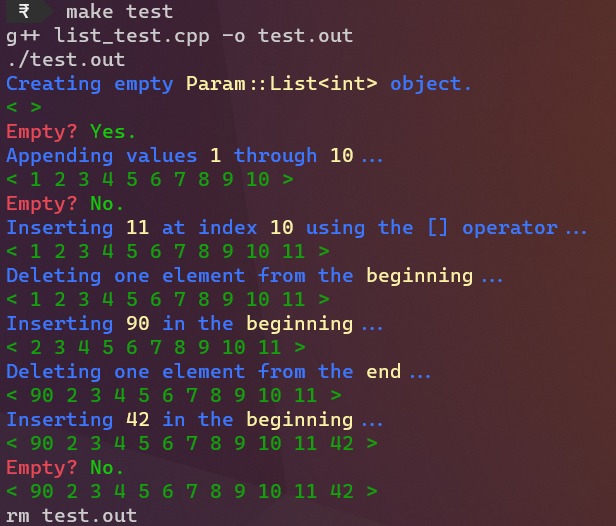

# Linked List
A fully-functional implementation of a linked list.

## Usage
The header file `linked_list` may simply be included to access `Param::List<T>`.
``` cpp
#include "linked_list"
```
### `Param::Node<T>`
This class represents the individual nodes in a list.

#### Constructor
``` cpp
Param::Node<T>::Node(T info = 0, Node<T> NEXT = nullptr)
```
Accepts a value for the data (of typename/class `T`) stored in the node, and a pointer for the next node if any.

#### Attributes
- `T Param::Node::INFO` : The data stored in the node.
- `Param::Node<T>* Param::Node::NEXT` : The pointer to the next node, or `nullptr` if absent.

### `Param::List<T>`
This class represents linked lists.

#### Constructor
``` cpp
Param::List<T>::List(Node<T>* HEAD = nullptr)
```
Accepts an existing `HEAD` node (of typename/class `T`) to be used in the linked list.

#### Destructor
``` cpp
Param::List<T>::~List()
```
Properly cleans up the dynamically allocated memory previously occupied by the list.

#### Attribute(s)
- `Node<T>* Param::List::HEAD` : Stores a pointer to the first node, or `nullptr` if the list is empty. It is a private attribute i. e. Not directly accessible.

#### Methods
- `bool Param::List::isEmpty()` : Check if the list is empty.
- `void Param::List::insertEnd(T info)` : Insert a new node at the end of the list with data `info`.
- `void Param::List::deleteEnd()` : Delete the last node in the list.
- `void Param::List::insertBeginning(T info)` : Insert a new node at the beginning of the list with data `info`.
- `void Param::List::deleteBeginning()` : Delete the first node in the list.
- `void Param::List::insertIndex(int index), T info` : Insert `info` at index `index`.
- `void Param::List::deleteIndex(int index)` : Delete the node at index `index`.
- `T& Param::List::getIndex(int index)` : Get a reference to the `INFO` of the node at index `index`. If absent, a new node is automatically created, so accessing invalid indices. A reference is returned to allow assignment.
- `T& Param::List::operator [](int index)` : Same as `T& getIndex(int index)`.
- `int Param::List::size()` : Returns the number of nodes currently in the list.
- `void Param::List::show()` : Displays the list into the console as follows
  ```
  < 1 2 3 ... n >
  ```
  Where 1, 2, 3, ..., n are the values stored in each of the nodes in the list.

## Testing
Compile and execute `list_test.cpp`.
``` bash
g++ list_test -o list_test
./list_test
```


## Made with ❤ by Param.